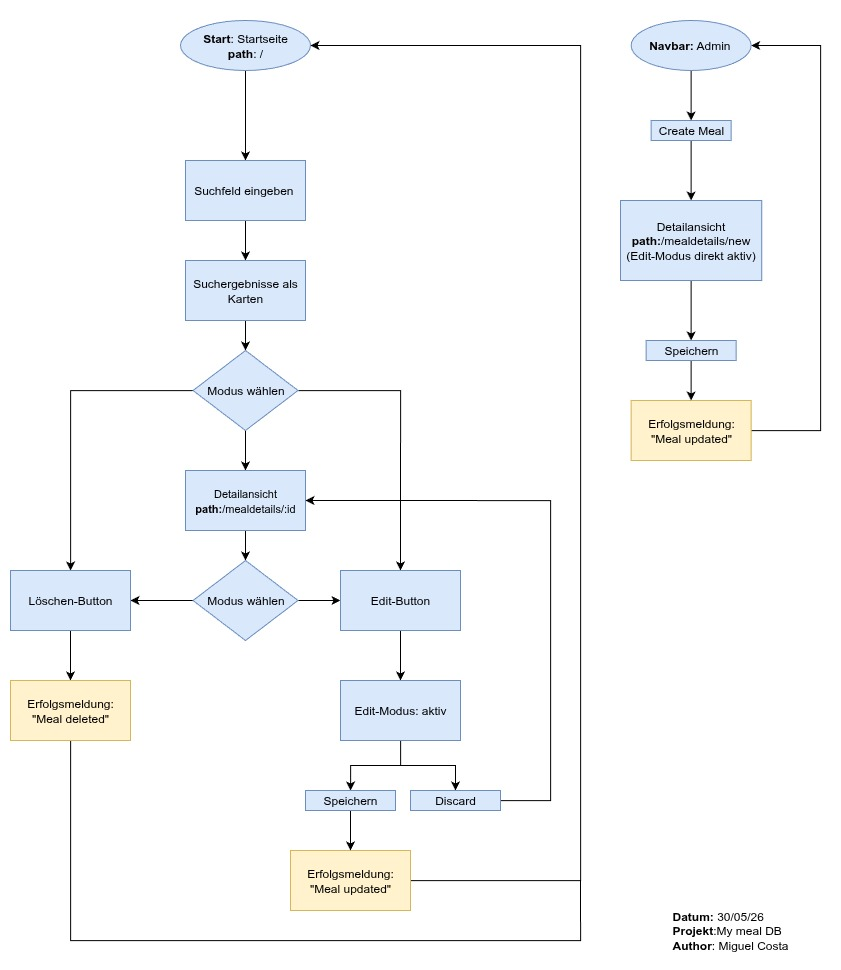
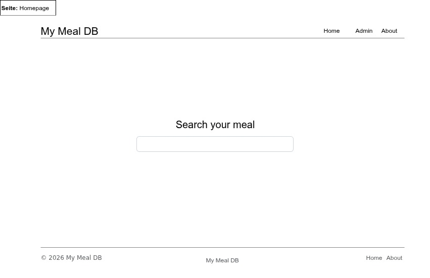
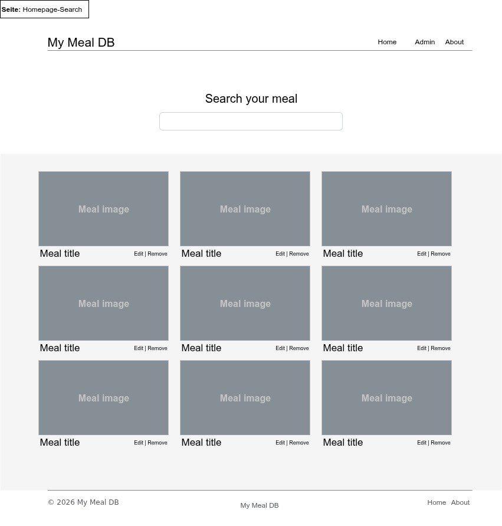
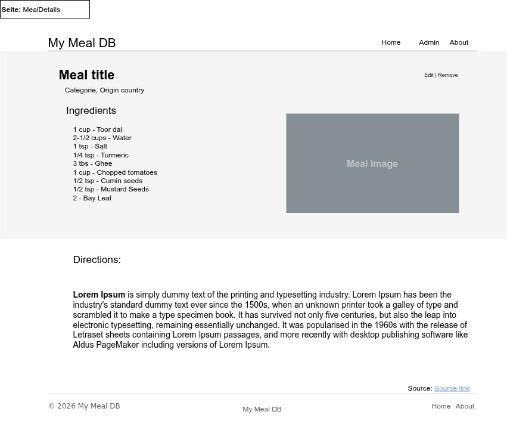
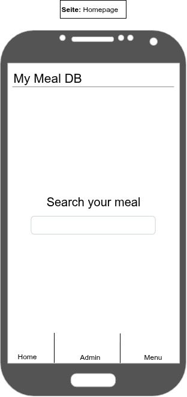
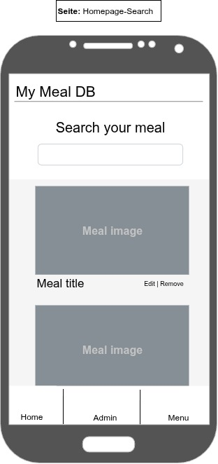
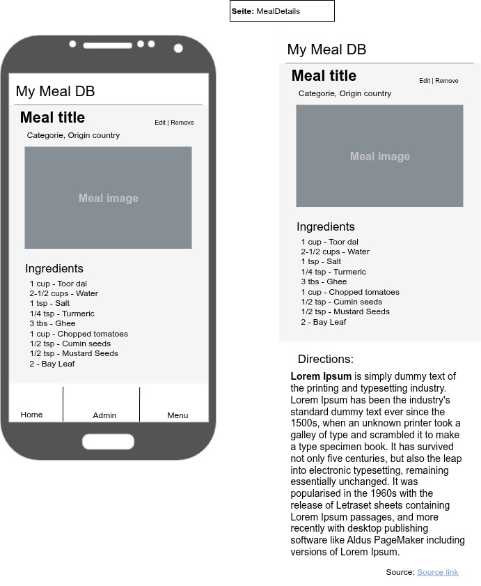

# Projektdokumentation — My Meal DB

---

## Titelblatt

**Projektname:** My meal DB

**Name:** Costa, Miguel

**Klasse:** UIFZ-2524-021

**Dozent:** Laveder, Graziano

**Abgabedatum:** 06/06/26 - 15:00             

**Modul:** 294 - Frontend einer interaktiven Webapplikation realisieren

---

## Inhaltsverzeichnis

1. [Projektidee](#1-projektidee)
2. [Anforderungskatalog](#2-anforderungskatalog)
3. [Klassendiagramm](#3-klassendiagramm)
4. [Storyboard](#4-storyboard)
5. [Screen-Mockups](#5-screen-mockups)
6. [REST-Schnittstellen](#6-rest-schnittstellen)
7. [Testplan](#7-testplan)
8. [Testergebnisse](#8-testergebnisse)
9. [Unit-Tests](#9-unit-tests)
10. [Installationsanleitung](#10-installa****tionsanleitung)
11. [Mögliche Erweiterungen](#11-mögliche-erweiterungen)
12. [Hilfestellungen](#12-hilfestellungen)

---

## 1. Projektidee

My Meal DB ist eine Webanwendung für Hobbyköche, die Rezepte einfach verwalten und entdecken möchten. Die App basiert auf der Struktur der öffentlichen TheMealDB-API, verwendet jedoch einen lokalen json-server als Backend.

Benutzer können Mahlzeiten nach Name durchsuchen und deren Details wie Zutaten, Zubereitungsanweisungen, Kategorie und Herkunftsland einsehen. Direkt auf der Detailseite lässt sich eine Mahlzeit über einen Edit-Modus anpassen oder löschen. Neue Rezepte können ebenfalls erfasst werden.

Die Applikation richtet sich an Hobbyköche, die eine übersichtliche und einfach bedienbare Rezeptverwaltung suchen.

---

## 2. Anforderungskatalog

### US01 — Mahlzeit suchen

*Als Hobbykoch möchte ich Mahlzeiten nach Name suchen können, damit ich schnell ein bestimmtes Rezept finde.*

Akzeptanzkriterien:

- Es gibt ein Suchfeld auf der Hauptseite
- Die Ergebnisse werden als Karten angezeigt
- Wenn keine Mahlzeit gefunden wird, erscheint keine Karte

### US02 — Mahlzeit-Details anzeigen

*Als Hobbykoch möchte ich die Details einer Mahlzeit sehen können, damit ich die Zutaten und Zubereitung kenne.*

Akzeptanzkriterien:

- Zutaten mit Mengenangaben werden angezeigt
- Zubereitungsanweisungen sind lesbar dargestellt
- Kategorie, Herkunftsland und ein Bild sind sichtbar

### US03 — Mahlzeit bearbeiten

*Als Administrator möchte ich eine Mahlzeit direkt auf der Detailseite bearbeiten können, damit ich Rezepte aktuell halten kann.*

Akzeptanzkriterien:

- Ein Button aktiviert den Edit-Modus auf der Detailseite
- Alle Felder sind im Edit-Modus änderbar
- Nach dem Speichern wird eine Erfolgsmeldung angezeigt

### US04 — Mahlzeit löschen

*Als Administrator möchte ich eine Mahlzeit löschen können, damit veraltete Rezepte entfernt werden können.*

Akzeptanzkriterien:

- Ein Löschen-Button ist auf der Detailseite und in den Suchergebnissen sichtbar
- Nach dem Löschen wird eine Erfolgsmeldung angezeigt

### US05 — Neue Mahlzeit erfassen

*Als Administrator möchte ich eine neue Mahlzeit erstellen können, damit eigene Rezepte zur Datenbank hinzugefügt werden.*

Akzeptanzkriterien:

- Es gibt ein Formular mit allen relevanten Feldern
- Pflichtfelder werden client-seitig validiert
- Nach dem Speichern erscheint die neue Mahlzeit in der Suche

---

## 3. Klassendiagramm


### Klasse: Meal

| Attribut     | Datentyp       | Beschreibung                                |
| ------------ | -------------- | ------------------------------------------- |
| id           | String         | Eindeutige ID (automatisch von json-server) |
| mealName     | String         | Name der Mahlzeit                           |
| category     | String         | Kategorie (z.B. Vegetarian)                 |
| area         | String         | Region                                      |
| country      | String         | Herkunftsland                               |
| instructions | String         | Zubereitungsanweisungen                     |
| mealThumb    | String (URL)   | URL des Vorschaubildes                      |
| ingredients  | Ingredient[]   | Liste der Zutaten (1:n)                     |
| source       | String (URL)   | Quelle des Rezepts                          |
| imageSource  | String \| null | Alternative Bildquelle                      |
| dateModified | String \| null | Änderungsdatum                              |

### Klasse: Ingredient

| Attribut         | Datentyp | Beschreibung            |
| ---------------- | -------- | ----------------------- |
| name             | String   | Name der Zutat          |
| measure_metric   | String   | Mengenangabe (metrisch) |
| measure_imperial | String   | Mengenangabe (imperial) |

**Beziehung:** `Meal` hat `1..*` `Ingredient` (Komposition)

---

## 4. Storyboard

### Navigationsfluss



---

## 5. Screen-Mockups

Die Screen-Mockups umfassen sowohl die Desktop- als auch die Mobile-Ansicht der Applikation. Die Mobile-Version wurde aus Zeitgründen nicht implementiert und ist unter den möglichen Erweiterungen aufgeführt.

### Desktop

#### Homepage



#### Homepage - search



#### MealDetails



### Mobile

#### Homepage



#### Homepage - search



#### MealDetails



## 6. REST-Schnittstellen

### Basis-URL

```
http://localhost:3001
```

Konfiguriert im Frontend via Environment-Variable: `VITE_API_URL`

---

### Datentyp: Meal

| Feld         | Typ          | Beschreibung                             | Pflicht     |
| ------------ | ------------ | ---------------------------------------- | ----------- |
| id           | String       | Eindeutige ID, von json-server generiert | automatisch |
| mealName     | String       | Name der Mahlzeit                        | ja          |
| category     | String       | Kategorie (z.B. Vegetarian)              | ja          |
| country      | String       | Herkunftsland                            | ja          |
| instructions | String       | Zubereitungsanweisungen                  | ja          |
| mealThumb    | String       | URL des Vorschaubildes                   | ja          |
| ingredients  | Ingredient[] | Liste der Zutaten                        | ja          |
| source       | String       | URL der Originalquelle                   | nein        |

### Datentyp: Ingredient

| Feld             | Typ    | Beschreibung          |
| ---------------- | ------ | --------------------- |
| name             | String | Name der Zutat        |
| measure_metric   | String | Mengenangabe metrisch |
| measure_imperial | String | Mengenangabe imperial |

---

### Endpoints

#### GET /meals?mealName:contains={keyword}

Sucht Mahlzeiten anhand des Namens.

- **Methode:** GET
- **Response:** 200 OK, Array von Meal-Objekten (auch leer möglich)
- **Fehler:** 500 bei Server-Problem

#### GET /meals/{id}

Liefert eine einzelne Mahlzeit anhand der ID.

- **Methode:** GET
- **Response:** 200 OK, Meal-Objekt
- **Fehler:** 404 falls ID nicht existiert

#### POST /meals

Erstellt eine neue Mahlzeit.

- **Methode:** POST
- **Headers:** `Content-Type: application/json`
- **Body:** Meal-Objekt (ohne id)
- **Response:** 201 Created, gespeichertes Meal-Objekt inkl. neuer id
- **Fehler:** 400 bei ungültigem Body

#### PUT /meals/{id}

Aktualisiert eine bestehende Mahlzeit vollständig.

- **Methode:** PUT
- **Headers:** `Content-Type: application/json`
- **Body:** komplettes Meal-Objekt
- **Response:** 200 OK, aktualisiertes Objekt
- **Fehler:** 404 falls ID nicht existiert

#### DELETE /meals/{id}

Löscht eine Mahlzeit.

- **Methode:** DELETE
- **Response:** 200 OK
- **Fehler:** 404 falls ID nicht existiert

---

## 7. Testplan

### Format eines Testfalls

| Feld                | Bedeutung                       |
| ------------------- | ------------------------------- |
| ID                  | Eindeutige Test-Nummer          |
| Titel               | Kurzer Name des Tests           |
| Vorbedingung        | Was muss vorher zutreffen?      |
| Schritte            | Wie wird der Test durchgeführt? |
| Erwartetes Ergebnis | Was sollte passieren?           |

---

### T1: Mahlzeit suchen

- **Vorbedingung:** Mindestens eine Mahlzeit ist in der Datenbank
- **Schritte:** Startseite aufrufen → Suchbegriff in das Suchfeld eingeben
- **Erwartetes Ergebnis:** Passende Mahlzeiten werden als Karten angezeigt

### T2: Keine Ergebnisse bei unbekanntem Suchbegriff

- **Vorbedingung:** json-server läuft
- **Schritte:** Suchbegriff eingeben der keiner Mahlzeit entspricht (z.B. "xyzxyz")
- **Erwartetes Ergebnis:** Es werden keine Karten angezeigt, kein Fehler

### T3: Mahlzeit-Details anzeigen

- **Vorbedingung:** Mindestens eine Mahlzeit in der Datenbank
- **Schritte:** Mahlzeit suchen → Karte anklicken
- **Erwartetes Ergebnis:** Detailseite zeigt Name, Kategorie, Herkunftsland, Bild, Zutaten und Anweisungen

### T4: Mahlzeit bearbeiten

- **Vorbedingung:** Mahlzeit-Detailseite ist geöffnet
- **Schritte:** Edit-Button klicken → Felder bearbeiten → Speichern-Button klicken
- **Erwartetes Ergebnis:** Erfolgsmeldung "Meal updated successfully" wird angezeigt

### T5: Pflichtfeld-Validierung beim Bearbeiten

- **Vorbedingung:** Edit-Modus ist aktiv auf der Detailseite
- **Schritte:** Feld "Meal name" leeren → Speichern-Button klicken
- **Erwartetes Ergebnis:** Formular wird nicht abgeschickt, Browser zeigt Pflichtfeld-Hinweis

### T6: Neue Mahlzeit erstellen

- **Vorbedingung:** json-server läuft
- **Schritte:** Navbar → Admin → "Create Meal" klicken → Formular ausfüllen → Speichern
- **Erwartetes Ergebnis:** Erfolgsmeldung "Meal created successfully" erscheint

### T7: Mahlzeit löschen

- **Vorbedingung:** Mindestens eine Mahlzeit existiert, Suchergebnisse sind sichtbar
- **Schritte:** Löschen-Button auf einer Karte klicken
- **Erwartetes Ergebnis:** Karte verschwindet sofort aus der Liste

---

## 8. Testergebnisse

| ID  | Testfall                                     | Status | Bemerkung                                                                                                                                                                                                                           |
| --- | -------------------------------------------- | ------ | ----------------------------------------------------------------------------------------------------------------------------------------------------------------------------------------------------------------------------------- |
| T1  | Mahlzeit suchen                              | OK     |                                                                                                                                                                                                                                     |
| T2  | Keine Ergebnisse bei unbekanntem Suchbegriff | OK     |                                                                                                                                                                                                                                     |
| T3  | Mahlzeit-Details anzeigen                    | OK     |                                                                                                                                                                                                                                     |
| T4  | Mahlzeit bearbeiten                          | OK     |                                                                                                                                                                                                                                     |
| T5  | Pflichtfeld-Validierung beim Bearbeiten      | OK     |                                                                                                                                                                                                                                     |
| T6  | Neue Mahlzeit erstellen                      | OK     | Nachdem eine Mahlzeit erstellt wurde, wird die Seite „Create a new meal" beim erneuten Aufrufen nicht neu geladen. Als Workaround muss zunächst eine andere Seite besucht werden, bevor eine weitere Mahlzeit erstellt werden kann. |
| T7  | Mahlzeit löschen                             | OK     |                                                                                                                                                                                                                                     |

---

## 9. Unit-Tests

Die Unit-Tests wurden mit **Vitest** und **React Testing Library** umgesetzt.

### `src/components/MealCard.test.jsx`

**Test 1 — MealCard rendert Name und Bild**
Prüft ob die MealCard-Komponente den Namen der Mahlzeit und das Vorschaubild korrekt anzeigt, wenn sie ein Meal-Objekt als Prop erhält.

**Test 5 — MealCard enthält Link zur Detailseite**
Prüft ob die MealCard einen klickbaren Link zur richtigen Detailseite enthält, z.B. `/mealdetails/99` für eine Mahlzeit mit der ID 99.

---

### `src/api/meals.test.js`

**Test 2 — searchMeal ruft die richtige URL auf**
Prüft ob die Funktion `searchMeal` beim Suchen die korrekte API-URL mit dem Suchbegriff aufruft, z.B. `mealName:contains=pasta`.

**Test 3 — deleteMeal sendet DELETE-Request**
Prüft ob die Funktion `deleteMeal` einen HTTP DELETE-Request an die richtige URL sendet, z.B. `/meals/42` für eine Mahlzeit mit der ID 42.

**Test 4 — searchMeal Fehlerbehandlung**
Prüft ob die Funktion `searchMeal` einen Fehler wirft wenn die API einen fehlgeschlagenen Response zurückgibt (z.B. bei nicht erreichbarem Server).

---

## 10. Installationsanleitung

### Voraussetzungen

- Node.js (Version 18 oder höher)
- npm
- Git

---

### 1. Repository klonen

```bash
git clone https://github.com/MAFernCosta/m294-mymealdb
cd m294-mymealdb
```

### 2. Abhängigkeiten installieren

```bash
npm install
```

### 3. Umgebungsvariable konfigurieren

Im Projekt ist eine `.env.example` Datei enthalten. Diese muss vor dem Start in `.env` umbenannt werden:

```bash
cp Front-End/.env.example Front-End/.env
```

Die Datei enthält folgende Variable:

```
VITE_API_URL=http://localhost:3001
```

### 4. Applikation starten

```bash
npm run dev
```

Dieser Befehl startet gleichzeitig:

- das React-Frontend auf `http://localhost:5173`
- die json-server API auf `http://localhost:3001`

### 5. Browser öffnen

```
http://localhost:5173
```

---

### Tests ausführen

Die Unit-Tests können mit folgendem Befehl vom Root-Verzeichnis aus gestartet werden:

```bash
npm run test
```

Oder direkt im Frontend-Verzeichnis:

```bash
cd Front-End
npm run test
```

---

## 11. Mögliche Erweiterungen

In einer zukünftigen Version der Applikation könnten folgende Features implementiert werden:

- **Mobile-Optimierung:** Anpassung des Layouts für Smartphones mit verbesserter Touch-Bedienung und responsivem Design
- **Kategorien & Länder-Navigation:** Dropdown in der Navbar mit allen verfügbaren Kategorien; auf der Detailseite können Kategorie und Herkunftsland angeklickt werden um alle Mahlzeiten dieser Kategorie bzw. dieses Landes anzuzeigen
- **Implementierung beider Masseinheiten:** Anzeige der Zutatenmengen sowohl in metrischen als auch in imperialen Einheiten, je nach Präferenz des Benutzers.
- **Admin-Modus:** Checkbox in der Navbar die einen Admin-Modus aktiviert — nur wenn dieser aktiv ist werden die Bearbeiten- und Löschen-Buttons eingeblendet
- **Dark Mode:** Umschaltbarer dunkler Farbmodus für die gesamte Applikation
- **Easter Egg:** Gibt der Benutzer "do a barrel roll" in das Suchfeld ein, dreht sich die gesamte Seite einmal um 360 Grad

---

## 12. Hilfestellungen

### KI-Tools (Claude — claude.ai)

- Unterstützung beim Schreiben und Korrigieren der Projektdokumentation
- Punktuelle Hilfe bei Syntax-Fragen im Code
- Vorschlag für das `concurrently`-Setup zum gleichzeitigen Starten von Frontend und Backend
- Unterstützung beim Einrichten von Vitest und Schreiben der Unit-Tests

### Internet-Quellen

- Bootstrap-Dokumentation und Beispiele für die visuelle Gestaltung und Seitenstruktur: https://getbootstrap.com
- Bootstrap Alerts (Styling der ResourceState-Komponente): https://www.tutorialrepublic.com/twitter-bootstrap-tutorial/bootstrap-alerts.php
- React-Dokumentation: https://react.dev/learn
- JavaScript-Referenz: https://www.w3schools.com/js/

### Unterrichtsmaterialien

- Klassennotizen und vom Dozenten bereitgestellte Dokumentation (Modul 294)
